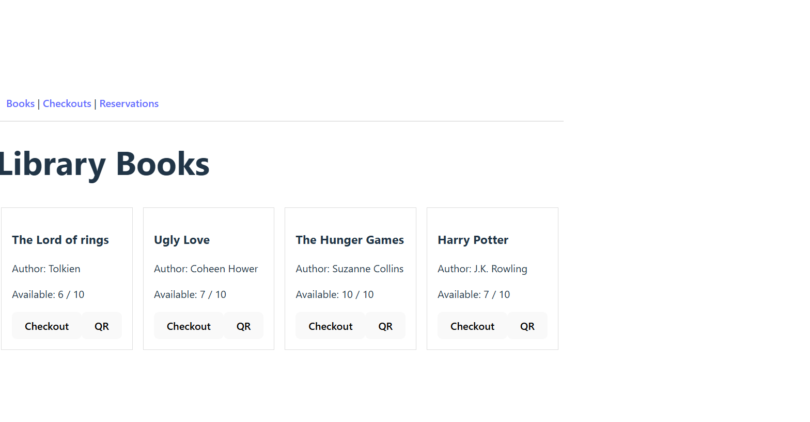
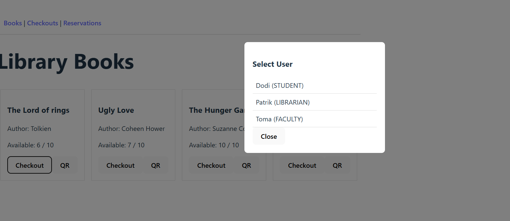
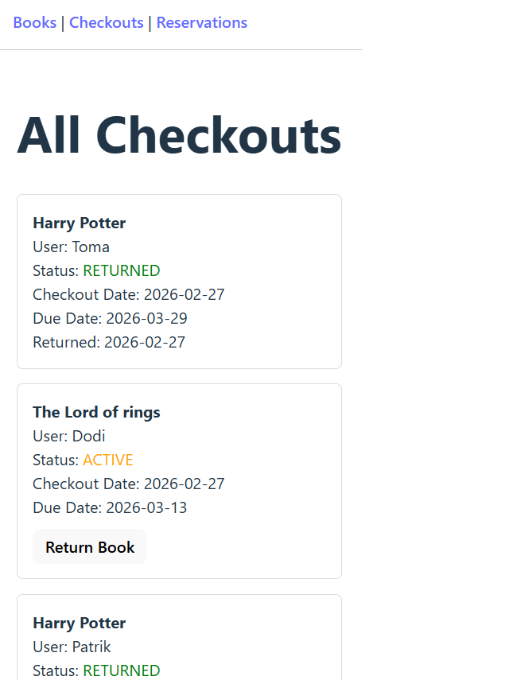
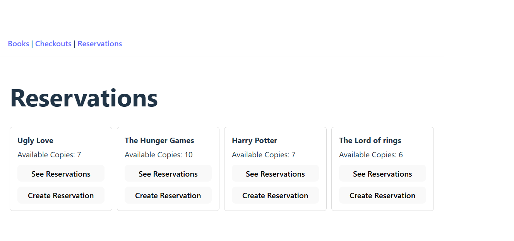
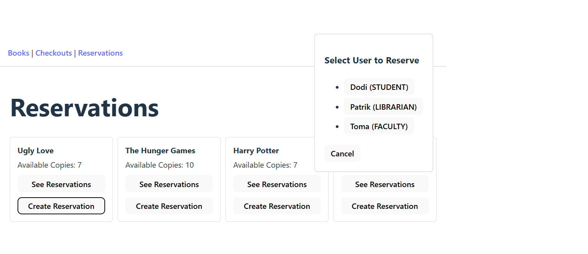
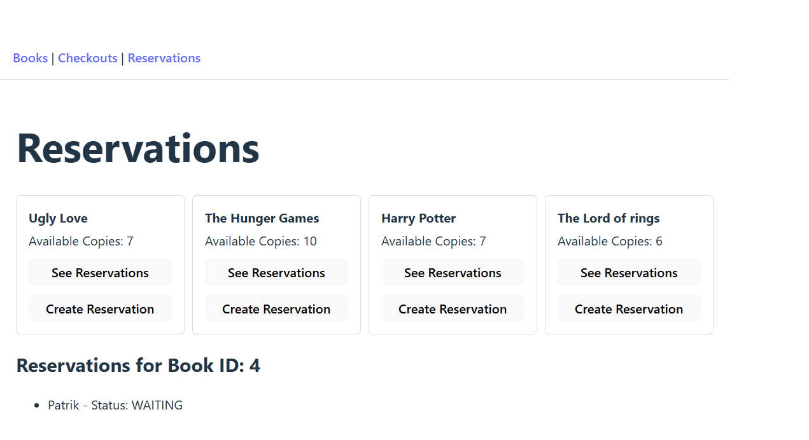

# Library Resource Checkout System - SSATR IA 2026

**Student**: Knecht Vivien

**Scenario**: 6. Library Resource Checkout System

## Project Overview

The main purpose of this project is managing the checkout and reservations of the books in a library. The system
keeps track of the checked out books and their due and returned dates. It also calculates the late fee if a book
is returned after the due date.

### Key Features

- Feature 1: Checking out books for users.
- Feature 2: Returning books.
- Feature 3: Calculating late fees.
- Feature 4: Reserving books for users.

### Technology stack

#### Backend

- Java 21 + Spring Boot 4.0.3
- PostgreSQL

#### Frontend

- React
- TypeScript

#### Infrastructure

- Maven

#### Additional Tools/Libraries

- google.zxing - for QR code generation

## System Architecture

### High-Level Architecture

The system uses a 3-tier architecture consisting of a FE client, BE server and a database.
The FE communicates with the BE through HTTP requests and the BE interacts with the database to persist 
the data in time.

#### Main Components

1. Frontend (React + TypeScript)
Responsible for the user interface. Allows users to view books, manage checkouts, create reservations, and return books. Communicates with the backend using REST API calls.

2. Backend (Java + Spring Boot)
Implements business logic for managing books, users checkouts and reservations. 

3. Database (PostgreSQL)
Stores persistent data including users, books, checkouts, and reservations.

### Data Flows

The admin can add books and users to the database. The books, their title, author and their availability is
visible in the UI, the checkouts and their statuses and also the reservations and their statuses.
Then checkouts, reservations and returns can be made from the UI.

### Simulations and Simplifications

The endpoints were tested in Postman and when building the UI, the requests and components used for display
were tested with hardcoded data.

### Screenshots

#### Books



#### Checking out books



#### Seeing the checkouts



#### Reservations



#### Making a reservations



#### Seeing the reservation



## Database Schema

In the database there are 4 tables: Books, Users, Checkouts and Reservations.
In each database the primary key is the id. In the Checkouts and Reservations
tables we have the book_id and the user_id as foreign keys.

## Running the Application

### Setup Instructions

1. Clone repository
```bash
   git clone https://github.com/vivienknecht/ssatr-lab-ia-vivienknecht.git
```

2. Open Backend part called Library-Resource-Checkout-System in IntelliJ and run the `LibraryResourceCheckoutSystemApplication` class.
3. Open Frontend.
4. Go to the frontend part:
```bash
   cd my-library-app
```
5. Start frontend
```bash
  npm run dev
```
6. Go to `http://localhost:5173/` in the browser

## Future improvements

- The FE can include sections where books and users can be added.
- Better design for the FE.
- Alert users via email or SMS when the book they have reserved is available.
- Alert user around due date and/or when the due date has passed.
- Mobile app using QR codes.